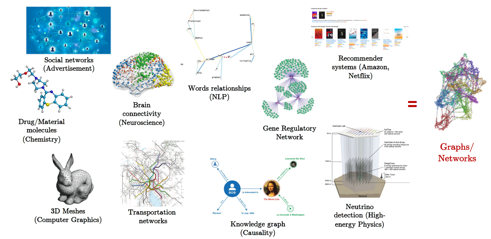
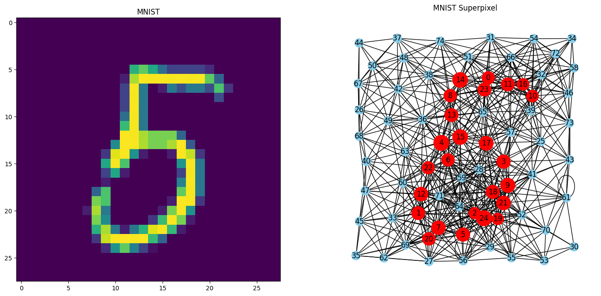
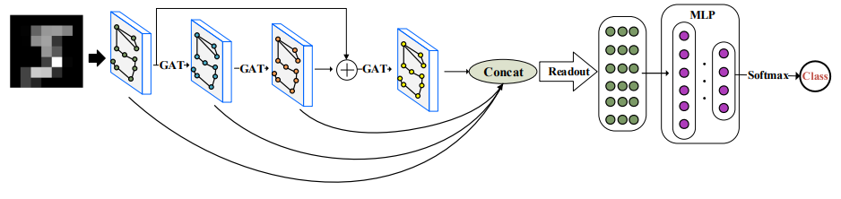

<h1 align="center">Graph Neural Network</h1>

<p align="center"></p>

## 1. Introduzione

All'interno di questo repository sono presenti alcune slide prese dal corso [CS224W: Machine Learning with Graphs](http://snap.stanford.edu/class/cs224w-2020/) tenuto dal Prof. [Jure Leskovec](https://profiles.stanford.edu/jure-leskovec).
Non sono state soggette a modifiche se non a qualche taglio utile per evitare di aggiungere informazioni poco necessarie ai fini di questo breve seminario, il cui scopo è quello di fornire una panoramica generale su questo nuovo
modello di reti, che negli ultimi anni sono diventate oggetto di molti studi in diversi campi applicativi.

Per chi volesse approfondire, il corso indicato (CS224W: Machine Learning with Graphs) è molto ampio e ben fatto, un piccolo riassunto di quello che verrà introdotto è indicato nella tabella in calce:

| Lezione | <p align="center">Descrizione</p> | <p align="center">Argomenti Trattati</p> |
| :---: | --- | --- |
| 1| [Introduzione e Machine Learning per Grafi](Slide/Lezione_1/01-intro_clean.pdf) | Apprendimento automatico con i grafi <br> Applicazioni e casi d'uso <br> Diversi tipi di compiti:<ul><li>Classificazione nodi</li><li>Classificazione archi</li> <li>Classificazione grafi</li></ul>Modalità rappresentazione del grafo:<ul><li>Diretto</li><li>Non diretto</li><li>Bipartito</li><li>Pesato</li><li>Matrice di adiacenza</li></ul>|
| 2 | [Metodi tradizionali di ML su grafi](Slide/Lezione_2/02-tradition-ml_clean.pdf)  | Pipeline ML tradizionali:<ul><li>Features create a mano</li></ul>Creazione features per grafi:<ul><li>A livello di nodo</li><ul><li>Grado del nodo</li></ul><ul><li>Centralità</li></ul><ul><li>Coefficiente di clustering</li></ul><ul><li>Graphlets</li></ul></ul><ul><li>A livello di link:</li><ul><li>Caratteristiche basate sulla distanza</li></ul><ul><li>Sovrapposizione locale/globale dei nodi vicini</li></ul></ul><ul><li>A livello di grafo:</li><ul><li>Kernel dei graphlets</li></ul><ul><li>Kernels Weisfeiler-Lehman Graph</li></ul>|
| 3 | [Rappresentazione vettoriale di nodi](Slide/Lezione_3/03-nodeemb_clean.pdf)   | <ul><li>Struttura encoder-decoder</li><li>Misura di similarità dei nodi</li><li>Estensione al Graph embedding</li></ul>|
| 4 | [Propagazione label per la classificazione dei nodi](Slide/Lezione_4/04-message_clean.pdf) | <ul><li>Sfruttare la correlazione nei grafi per fare previsioni sui nodi</li><li>Tecniche utilizzate<ul><li>Classificazione relazionale</li></ul><ul><li>Classificazione iterativa</li></ul><ul><li>Passaggio di messaggi somma-prodotto(Belief Propagation)</li></ul></li>|
| 5 | [Reti neurali su grafo 1: Modello GNN](Slide/Lezione_5/05-GNN1_clean.pdf)  | <ul><li>Fondamenta sulle reti neurali</li><li>Idea di apprendimento profondo per i grafi</li><li>Rete convoluzionale su grafo</li><li>GraphSAGE: aggregazione più flessibile</li></ul> |
| 6 | [Reti neurali su grafo 2: Spazio di progettazione](Slide/Lezione_6/06-GNN1_clean.pdf)| <ul><li>Layer GNN</li><li>Connessione tra layer</li><li>Manipolazione grafi</li></ul> |

## 2. Codice

Per facilitare la comprensione di quanto riportato all'interno delle slide, è stato realizzato un piccolo progetto prettamente didattico che sfrutta uno dei dataset messo a disposizione all'interno del framework [PyG](https://pytorch-geometric.readthedocs.io/en/latest/). E' il framework di riferimento per applicazioni di questo tipo, ve ne sono molti altri, ma essendo un estensione del framework di PyTorch è molto utilizzato in ambito scientifico/accademico. Il dataset utilizzato è una versione revisionata del ben noto MNIST, denominato MNIST superpixels. Il dataset MNIST superpixels, tratto dall'articolo ["Geometric Deep Learning on Graphs and Manifolds Using Mixture Model CNNs"](https://arxiv.org/pdf/1611.08402.pdf), contiene 70.000 grafi con 75 nodi ciascuno. Ogni grafo è etichettato da una delle 10 classi.

Esempio di rappresentazione su grafo di un sample del dataset, con rappresentazione vettoriale dello stesso numero:

<p align="left"></p>

E' possibile lanciare il codice direttamente da terminale con lo script sottostante per la fase di training del modello:

```python
!python train_model.py
```

mentre per quando riguarda il test del modello lanciare quello sottostante.:

```python
!python test_model.py
```

Diversamente è stato realizzato un jupyter notebook [MNIST_SuperPixel_GCN](src/MNIST_SuperPixel_GCN.ipynb) che permette di visualizzare anche le curve di accuracy e loss tramite [tensorboardX](https://github.com/lanpa/tensorboardX).

# 3. Modello

Il modello costruito è quello rappresentato nell'immagine sottostante presa come riferimento dal paper [A Graph Neural Network for superpixel image
classification](https://iopscience.iop.org/article/10.1088/1742-6596/1871/1/012071/pdf), e prevede l'utilizzo di tre layer [GATConv](https://pytorch-geometric.readthedocs.io/en/latest/generated/torch_geometric.nn.conv.GATConv.html) più lo skip di delle connessioni tra i vari layer che vengono nuovamente aggregati nello steato finale con i nodi degli strati precedenti. Il GATConv, è la classe che modella una Graph Attention Network, il cui coefficiente di attention è calcolato secondo oppurtuna relazione matematica. Una trattazione rigorosa del parametro di attention è presente all'interno del paper [Graph Attention Networks](https://arxiv.org/pdf/1710.10903.pdf).

<p align="center"></p>

# 4.Approfondimenti

In questa sezione sono riportati alcuni documenti di interesse utili per eventuali approfondimenti.

<style type="text/css">
  .tg  {border-collapse:collapse;border-spacing:0;}
  .tg td{border-color:black;border-style:solid;border-width:1px;font-family:Arial, sans-serif;font-size:14px;
    overflow:hidden;padding:10px 5px;word-break:normal;}
  .tg th{border-color:black;border-style:solid;border-width:1px;font-family:Arial, sans-serif;font-size:14px;
    font-weight:normal;overflow:hidden;padding:10px 5px;word-break:normal;}
  .tg .tg-c3ow{border-color:inherit;text-align:center;vertical-align:top}
  .tg .tg-0pky{border-color:inherit;text-align:left;vertical-align:top}
  .tg .tg-y02l{border-color:inherit;color:#00E;text-align:left;vertical-align:top}
</style>
<table class="tg">
  <thead>
    <tr>
      <th class="tg-c3ow" colspan="2">
        Risorse Per Approfondimenti e Maggiori Dettagli
      </th>
    </tr>
  </thead>
  <tbody>
    <tr>
      <td class="tg-0pky">Stanford Course</td>
      <td class="tg-0pky">
        <a
          href="https://www.youtube.com/watch?v=JAB_plj2rbA&list=PLoROMvodv4rPLKxIpqhjhPgdQy7imNkDn"
          target="_blank"
          rel="noopener noreferrer"
          >Video Lezioni Corso CS224W</a
        >
      </td>
    </tr>
    <tr>
      <td class="tg-0pky">Petar Veličković</td>
      <td class="tg-0pky">
        <a
          href="https://www.youtube.com/watch?v=pZBNdGMG1rQ"
          target="_blank"
          rel="noopener noreferrer"
          >AI x Mathematics</a
        >
      </td>
    </tr>
    <tr>
      <td class="tg-0pky">Petar Veličković</td>
      <td class="tg-y02l">
        <a
          href="https://www.youtube.com/watch?v=uF53xsT7mjc"
          target="_blank"
          rel="noopener noreferrer"
          >Theoretical Foundations of Graph Neural Networks</a
        >
      </td>
    </tr>
    <tr>
      <td class="tg-0pky">Petar Veličković</td>
      <td class="tg-y02l">
        <a
          href="https://www.youtube.com/watch?v=IPQ6CPoluok"
          target="_blank"
          rel="noopener noreferrer"
          >Graph Representation Learning for Algorithmic Reasoning</a
        >
      </td>
    </tr>
    <tr>
      <td class="tg-0pky">Book</td>
      <td class="tg-0pky">
        <a
          href="https://www.cs.mcgill.ca/~wlh/grl_book/"
          target="_blank"
          rel="noopener noreferrer"
          >Graph Representation Learning Book</a
        >
      </td>
    </tr>
    <tr>
      <td class="tg-0pky">Microsoft Research Lab</td>
      <td class="tg-0pky">
        <a
          href="https://www.youtube.com/watch?v=zCEYiCxrL_0"
          target="_blank"
          rel="noopener noreferrer"
          >An Introduction to Graph Neural Networks: Models and Applications</a
        >
      </td>
    </tr>
    <tr>
      <td class="tg-0pky">Michael Bronstein</td>
      <td class="tg-0pky">
        <a
          href="https://www.youtube.com/watch?v=5c_-KX1sRDQ&list=PLn2-dEmQeTfSLXW8yXP4q_Ii58wFdxb3C"
          target="_blank"
          rel="noopener noreferrer"
          >AMMI 2022 Course "Geometric Deep Learning"</a
        >
      </td>
    </tr>
    <tr>
      <td class="tg-0pky">NYU GCN 1</td>
      <td class="tg-0pky">
        <a
          href="https://www.youtube.com/watch?v=Iiv9R6BjxHM&list=PLLHTzKZzVU9eaEyErdV26ikyolxOsz6mq&index=25&t=6313s"
          target="_blank"
          rel="noopener noreferrer"
          >Lecture: Graph Convolutional Networks (GCNs)</a
        >
      </td>
    </tr>
    <tr>
      <td class="tg-0pky">NYU GCN 2</td>
      <td class="tg-0pky">
        <a
          href="https://www.youtube.com/watch?v=2aKXWqkbpWg&list=PLLHTzKZzVU9eaEyErdV26ikyolxOsz6mq&index=26"
          target="_blank"
          rel="noopener noreferrer"
          >Practicum: Graph Convolutional Neural Networks (GCN)</a
        >
      </td>
    </tr>
    <tr>
      <td class="tg-0pky">Book</td>
      <td class="tg-0pky">
        <a
          href="http://www.cs.cornell.edu/home/kleinber/networks-book/"
          target="_blank"
          rel="noopener noreferrer"
          >Networks, Crowds, and Markets</a
        >
      </td>
    </tr>
    <tr>
      <td class="tg-0pky">Book</td>
      <td class="tg-0pky">
        <a
          href="http://networksciencebook.com/"
          target="_blank"
          rel="noopener noreferrer"
          >Network Science Book</a
        >
      </td>
    </tr>
    <tr>
      <td class="tg-0pky">MIT Prof. Workshop</td>
      <td class="tg-0pky">
        <a
          href="https://www.youtube.com/watch?v=W4-K9-wZkVA"
          target="_blank"
          rel="noopener noreferrer"
          >Theory of Graph Neural Networks</a
        >
      </td>
    </tr>
    <tr>
      <td class="tg-0pky">PyTorch Tutorial</td>
      <td class="tg-0pky">
        <a
          href="https://github.com/Atcold/torch-Video-Tutorials"
          target="_blank"
          rel="noopener noreferrer"
          >Torch Video Tutorials</a
        >
      </td>
    </tr>
    <tr>
      <td class="tg-0pky">Lezioni MIT Stefanie Jegelka</td>
      <td class="tg-0pky">
        <a
          href="https://phillipi.github.io/6.s898/"
          target="_blank"
          rel="noopener noreferrer"
          >Week 4 - Architectures -Graphs and Geometric deep learning</a
        >
      </td>
    </tr>
  </tbody>
</table>
